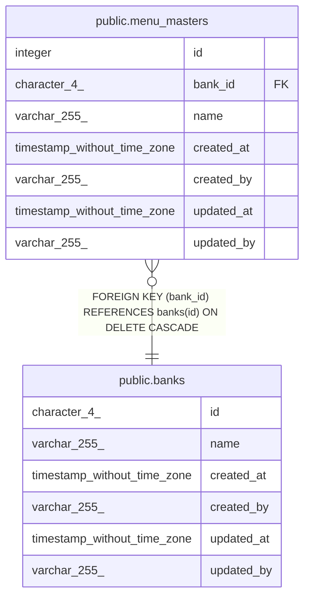

# bap

## テーブル一覧

| 名前 | カラム一覧 | コメント | タイプ |
| ---- | ------- | ------- | ---- |
| [public.banks](public.banks.md) | 6 | 全体休日設定テーブル | BASE TABLE |
| [public.menu_masters](public.menu_masters.md) | 7 | メニューマスターテーブル | BASE TABLE |

## ER図

---

> Generated by [tbls](https://github.com/k1LoW/tbls)
