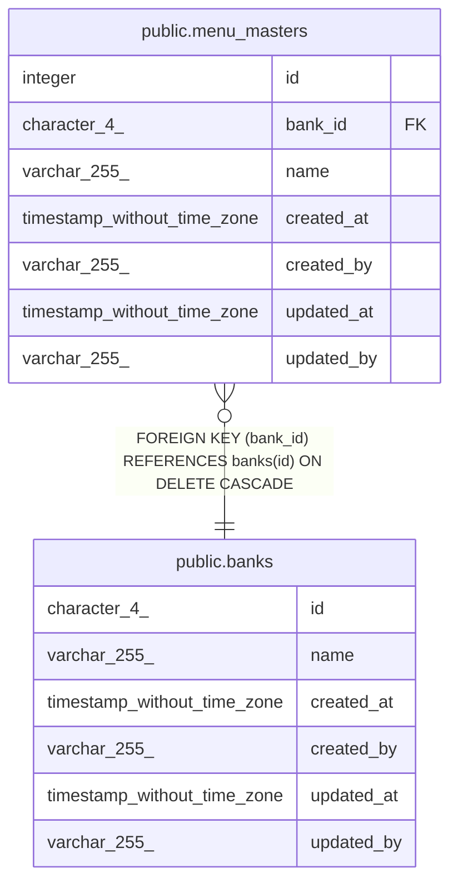

# public.banks

## 概要

全体休日設定テーブル

## カラム一覧

| 名前 | タイプ | デフォルト値 | Nullable | 子テーブル | 親テーブル | コメント |
| ---- | ------ | ------------ | -------- | ---------- | ---------- | -------- |
| id | character(4) |  | false | [public.menu_masters](public.menu_masters.md) |  | ID |
| name | varchar(255) |  | false |  |  | 銀行名 |
| created_at | timestamp without time zone | CURRENT_TIMESTAMP | false |  |  | 登録日時 |
| created_by | varchar(255) |  | false |  |  | 登録者 |
| updated_at | timestamp without time zone | CURRENT_TIMESTAMP | false |  |  | 更新日時 |
| updated_by | varchar(255) |  | false |  |  | 更新者 |

## 制約一覧

| 名前 | タイプ | 定義 |
| ---- | ---- | ---------- |
| banks_pkey | PRIMARY KEY | PRIMARY KEY (id) |

## INDEX一覧

| 名前 | 定義 |
| ---- | ---------- |
| banks_pkey | CREATE UNIQUE INDEX banks_pkey ON public.banks USING btree (id) |

## ER図

---

> Generated by [tbls](https://github.com/k1LoW/tbls)
