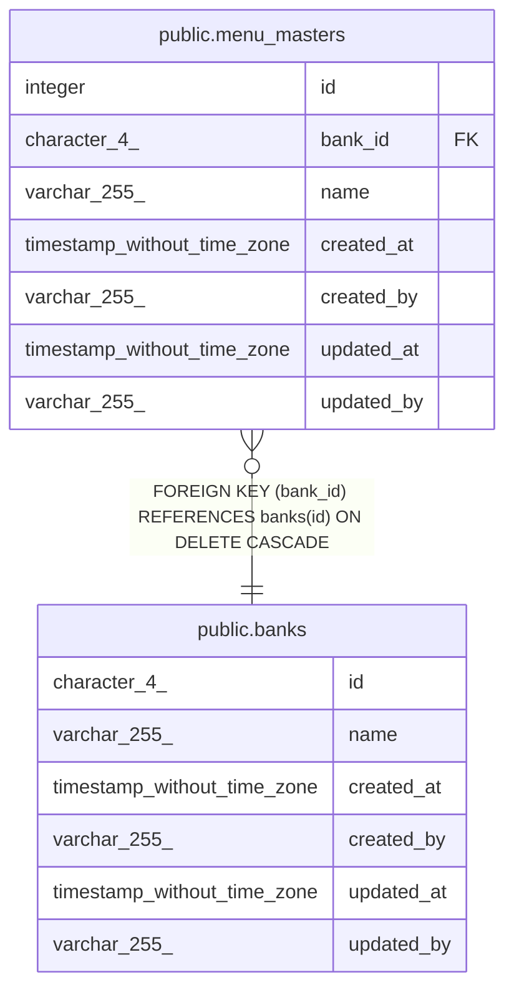

# public.menu_masters

## 概要

メニューマスターテーブル

## カラム一覧

| 名前 | タイプ | デフォルト値 | Nullable | 子テーブル | 親テーブル | コメント |
| ---- | ------ | ------------ | -------- | ---------- | ---------- | -------- |
| id | integer | nextval('menu_masters_id_seq'::regclass) | false |  |  | ID |
| bank_id | character(4) |  | false |  | [public.banks](public.banks.md) | 銀行ID |
| name | varchar(255) |  | false |  |  | 名前 |
| created_at | timestamp without time zone | CURRENT_TIMESTAMP | false |  |  | 登録日時 |
| created_by | varchar(255) |  | false |  |  | 登録者 |
| updated_at | timestamp without time zone | CURRENT_TIMESTAMP | false |  |  | 更新日時 |
| updated_by | varchar(255) |  | false |  |  | 更新者 |

## 制約一覧

| 名前 | タイプ | 定義 |
| ---- | ---- | ---------- |
| menu_masters_bank_id_fkey | FOREIGN KEY | FOREIGN KEY (bank_id) REFERENCES banks(id) ON DELETE CASCADE |
| menu_masters_pkey | PRIMARY KEY | PRIMARY KEY (id) |

## INDEX一覧

| 名前 | 定義 |
| ---- | ---------- |
| menu_masters_pkey | CREATE UNIQUE INDEX menu_masters_pkey ON public.menu_masters USING btree (id) |
| idx_menu_masters_bank_id | CREATE INDEX idx_menu_masters_bank_id ON public.menu_masters USING btree (bank_id) |
| idx_menu_masters_bank_id_name | CREATE UNIQUE INDEX idx_menu_masters_bank_id_name ON public.menu_masters USING btree (bank_id, name) |

## ER図

---

> Generated by [tbls](https://github.com/k1LoW/tbls)
